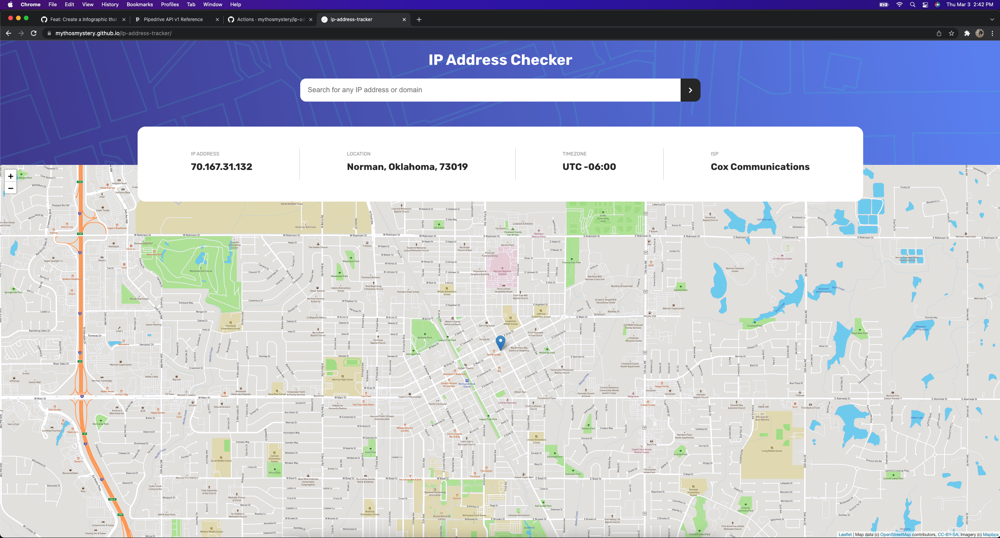

# IP Address Tracker

Built with Vue.js, Leaflet.js, and the IPIFY Geolocation API.
Also using Vuex, PUG, and SCSS

## Screenshots

 

## Project setup

```
yarn install
```

### Compiles and hot-reloads for development

```
yarn serve
```

### Compiles and minifies for production

```
yarn build
```

### Lints and fixes files

```
yarn lint
```

### Customize configuration

See [Configuration Reference](https://cli.vuejs.org/config/).
